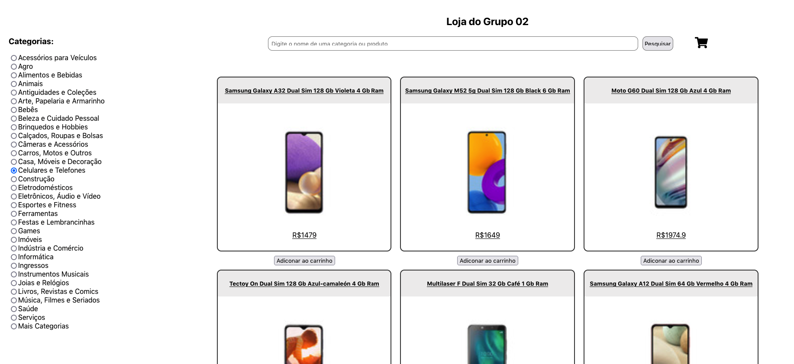
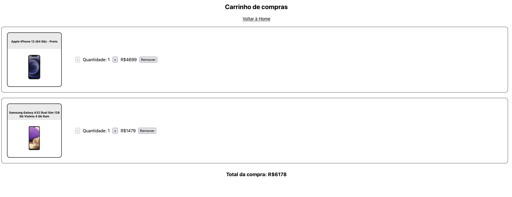

## Sobre o Projeto
Esse foi o segundo projeto em grupo da Trybe. O objetivo dele era de construir um front-end para uma loja online utilizando uma API do Mercado Livre, fazendo o uso de React e de Metodologias Ágeis, como Kanban e Scrum.

### Preview

